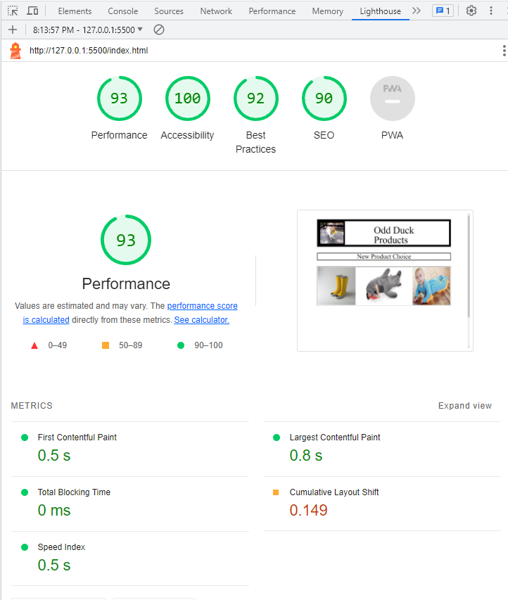

# ODD DUCK

Odd Duck is a tool used to select images that are randomly generated and receive feedback after 25 clicks of how many times you saw each image and how many times you clicked each image.

The images will be stored in a local storage where the tabulation of clicks and views will be continuously counted.  

Below is a lighthouse image showing the report for the webpage. 
;

# CONTACT

If you have any questions or concerns, please email use at jey6639@gmail.com.

# WEBSITE

The url for the website is https://jyoung57.github.io/odd-duck/